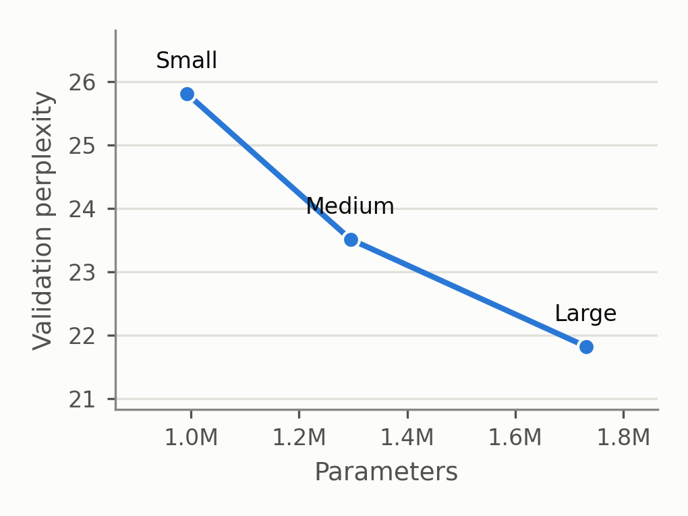
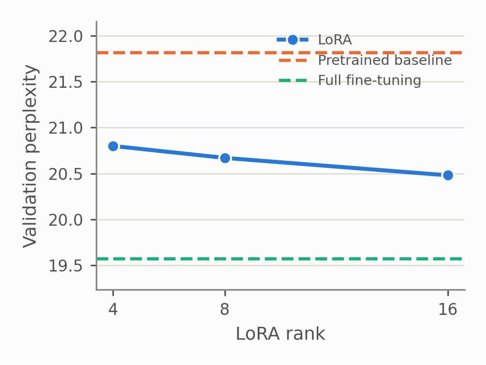
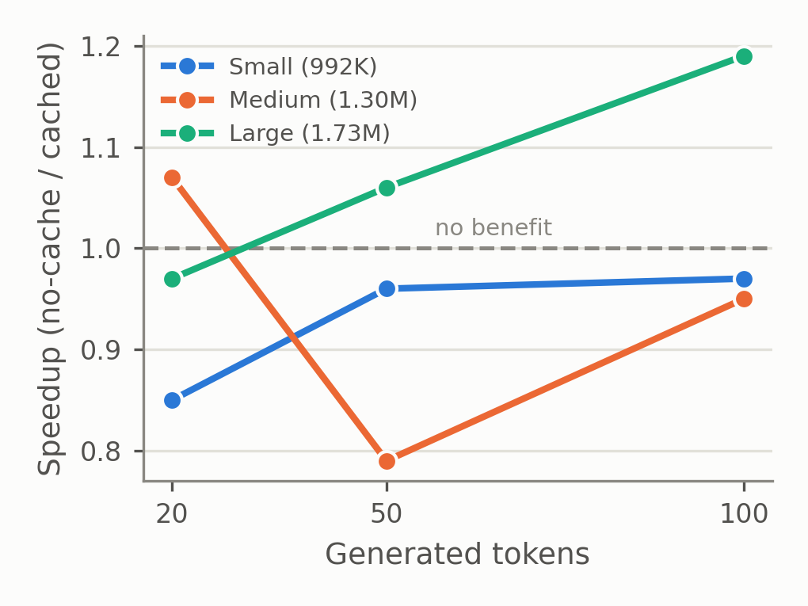

# TinyLLM

A from-scratch, decoder-only GPT-style language model with a custom BPE tokenizer, trained on [TinyStories](https://huggingface.co/datasets/roneneldan/TinyStories). Built to run controlled experiments on three questions that are well studied at large model scale but rarely tested at ~1–2M parameters:

- **Scaling** — does more parameters reliably help at this scale?
- **PEFT** — how does LoRA compare to full fine-tuning, matched by trainable parameter count?
- **KV caching** — does it actually speed up generation for models this small?

Everything is implemented from scratch on top of PyTorch — no `transformers`, no existing tokenizer library. Full write-up, methodology, and results: [`results/report.md`](results/report.md).

## What's here

| File | What it is |
|---|---|
| `BPE.py` | From-scratch byte-pair-encoding tokenizer (training + encode/decode), with an `<unk>` fallback for out-of-vocab characters |
| `dataset.py` | Loads + preprocesses TinyStories, trains the tokenizer, produces token-id sequences |
| `model.py` | The GPT model — causal self-attention, pre-norm blocks, weight tying, and KV-cache-aware generation |
| `lora.py` | LoRA (`LoRALinear`) — wraps a frozen linear layer with a trainable low-rank update |
| `train.py` | Core training loop (`train_model`), reused by every experiment script below |
| `metrics.py` | Evaluation: perplexity, bits-per-char, top-k accuracy, a unigram baseline, and KV-cache latency benchmarking |
| `scaling_experiment.py` | Standalone: trains several model sizes on shared data |
| `peft_experiment.py` | Standalone: LoRA (multiple ranks) vs. full fine-tuning vs. doing nothing, on a pretrained checkpoint |
| `run_experiments.py` | The full pipeline used for the paper — scaling, then PEFT, then KV-cache latency — writes `results/report.md` + `results/report_data.json` |
| `generate_figures.py` | Renders the 5 figures in `results/figs/` from `results/report_data.json` |

## Setup

```bash
pip install -r requirements.txt
```

Requires Python 3.10+. Tested on PyTorch 2.4.0 with the MPS backend (Apple Silicon); also works on CUDA/CPU.

## Usage

Train a single model from scratch:

```bash
python3 train.py
```

This loads TinyStories, trains a BPE tokenizer (vocab size 1000 by default), trains the model, and saves `checkpoints/checkpoint.pt`. Checkpoints aren't tracked in this repo (see `.gitignore`) — train your own, or run the full pipeline below.

Evaluate a trained checkpoint (perplexity, accuracy, bits-per-char, generation diversity, throughput):

```bash
python3 metrics.py                 # full report
python3 metrics.py --kv-cache      # KV-cache latency comparison only
```

Run the full experiment pipeline (scaling + PEFT + KV-cache latency — all three sections of the paper):

```bash
python3 run_experiments.py
```

This is a long-running job (BPE training + 3 training runs + PEFT fine-tuning + latency sweeps) — run it in the background. Writes `results/report.md`, `results/report_data.json`, and one checkpoint per model size to `checkpoints/`.

Regenerate the figures from existing results:

```bash
python3 generate_figures.py
```

Standalone experiment scripts, for ad-hoc runs without the full pipeline:

```bash
python3 scaling_experiment.py   # model-size sweep only
python3 peft_experiment.py      # LoRA vs. full fine-tune only (needs checkpoints/checkpoint.pt from train.py)
```

## Results

Trained three models (992K / 1.30M / 1.73M parameters) from scratch on a shared 8,000-story TinyStories subset and tokenizer, then compared LoRA against full fine-tuning on the largest model, then benchmarked KV-cache generation latency at each size. Headline findings — full methodology, every table, and the complete `[TO ADD]`-filled write-up in [`results/report.md`](results/report.md):

- **Scaling**: perplexity improved monotonically across all three sizes tested (25.81 → 23.51 → 21.82), with no plateau observed in this range.
- **LoRA vs. full fine-tuning**: LoRA cut trainable parameters by up to ~26x while recovering most of full fine-tuning's quality gain — but did *not* train faster in wall-clock time; full fine-tuning was consistently faster despite updating far more parameters.
- **KV caching**: latency effects were small and inconsistent at these model sizes and generation lengths (0.79x–1.19x), not the large, reliable speedup caching gives at production LLM scale.

<p align="center">
  
  
  
</p>

## License

MIT — see [LICENSE](LICENSE).
